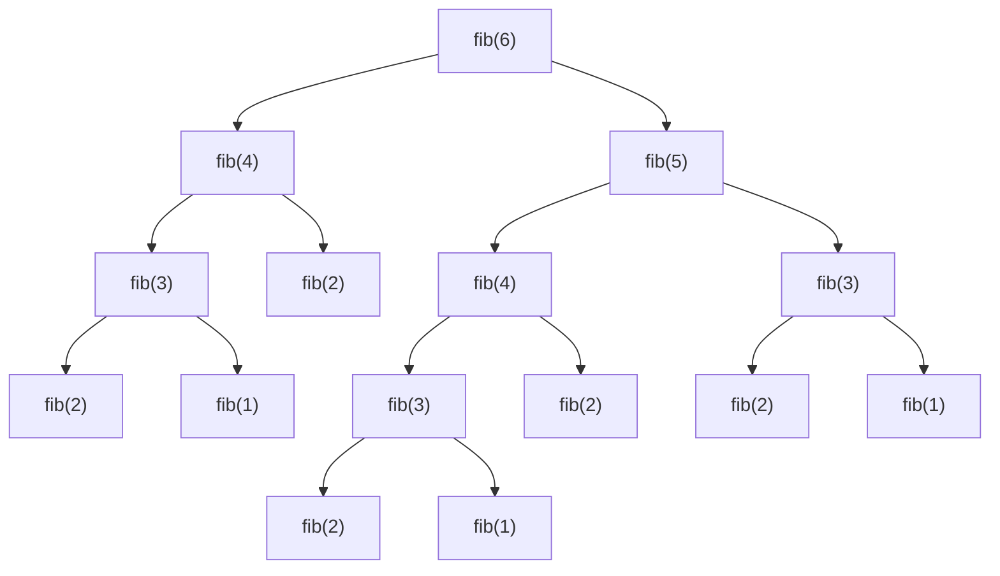
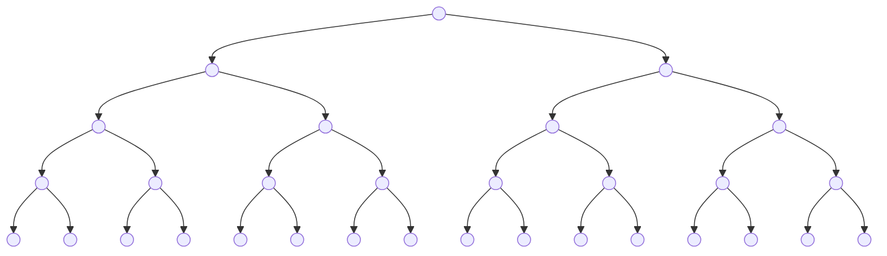

# Understanding Program Efficiency: 2
## Logarithmic complexity
An example of **logarithmic complexity** is **bisection search**. If we need to find a particular element in a *sorted* list, we can do better than sequential search (which is linear in complexity). 

The principle underlying bisection search is **divide and conquer**:
* Break a big problem into a smaller problem (here, a smaller list), plus some operations
* The answer to the smaller version is the answer to the original problem

In **pseudocode**, the bisection search algorithm is:
* Pick an index `midpoint` that divides list `L` in half
* Ask if `L[midpoint] == e`
	* If yes, return `midpoint`
* If not, ask if `L[midpoint] > e`
	* If yes, search the left half of `L` for `e`
* The only remaining possibility is that `L[midpoint] < e`
	* Search the right half of `L` for `e`

**Theoretical proof** of bisection search's logarithmic complexity:
* Let the number of elements in the list be n, and the number of iterations of recursion required be i
* We finish looking through the list when, in the worst case, 1 element remains
* On each iteration, we divide the number of elements in our list by 2, so finally, when we've found the answer in the worst case, the length of our list is n/2ⁱ
* From the above two claims, 1 = n/2ⁱ, so i = log n
* So, the complexity of recursion is **O(log n), where n is len(L)**

**First pass at implementing bisection search**:
```
def bisect_search1(L, e):
	if L == []:
			return False
	elif len(L) == 1:
		return L[0] == e
	else:
		midpoint = len(L) // 2
		if L[midpoint] > e:
			return bisect_search1(L[:half], e)
		else:
			return bisect_search1(L[half:], e)
``` 
Analyzing the program's time **complexity**:
* There are O(log n) search calls
	* This is because if the size of the list is n, then in the worst case, the program needs to make log n search calls
* However, each search call has to copy the list, which is O(n) in complexity
* Hence, the complexity of the program is **naively O(log n) * O(n) = O(n log n)**
	* This seems even worse than sequential search, which is O(n)!  
* However, if we're *really* careful, we'll notice that in our version of bisection search, the length of list to be copied is halved on each recursive call. This must be accounted for while analyzing the program's complexity; we cannot simply multiply the number of recursive calls (ie, log n) by the length of the complete list (ie, n) to arrive at O(n log n) complexity
	* The true cost to copy is the geometric series n/2 (length of list copied on first call) + n/4 (second call) + … with log n terms
	* Why log n terms? Because that's the number of recursive calls to be made in the worst case
	* On summing this series, we find that this algorithm's **true complexity is O(n)** 

**Second pass at implementing bisection search**:
* The principle is the same as the first pass, but this time, we'll note the indices of the subsequence's lower and upper end only, instead of copying the entire subsequence
* Then, we'll evaluate the middle of the subsequence represented by these ends against the element we're searching for
* We'll incur a constant cost for copying the ends of the subsequences, instead of a cost that scales with the list size
```
def bisect_search2(L, e):
	def bisect_search_helper(L, e, low, high):
		if high == low:
			return L[low] == e
		mid = (low + high) // 2
		if L[mid] == e:
			return True
		elif L[mid] > e:
			if low == mid: # nothing left to search
				return False
			else:
				return bisect_search_helper(L, e, low, mid - 1)
		else:
			return bisect_search_helper(L, e, mid + 1, high)
	
	if len(L) == 0:
		return False
	else:
		return bisect_search_helper(L, e, 0, len(L) - 1)		
```
Analyzing the program's time **complexity**:
* There are **O(log n)** search calls
	* In the worst case, the list needs to be kept halving until just 1 element is left; log n halvings required
* **O(1)** work on each recursive call
	* A constant cost is incurred on copying the start and end indices of the list
* The complexity of the program is **O(log n) * O(1) = O(log n)**
***
Another example of **logarithmic complexity** is this **integer-to-string conversion algorithm**.
```
def intToStr(i):
	digits = "0123456789"
	if i == 0:
		return "0"
	result = ""
	while i > 0:
		result = digits[i%10] + result
		i = i // 10
	return result
```
Analyzing the program's time **complexity**:
* We only need to look at the loop to find the complexity because there are no function calls in this program
* **O(1)** cost of doing steps within the `while` loop
* The loop is executed **O(log i)** times
	* If the integer to be converted is i, the number of times the loop executes is the same as the number of times one can divide i by 10, ie, log₁₀ i
	* Of course, however, the complexity is linear with respect to the number of digits in i
## Linear complexity
**Iterative factorial is O(n)**:
```
def fact_iter(n):
	prod = 1
	for i in range(1, n+1):
		prof *= i
	return prod
```
The loop executes n times (O(n)), incurring a constant cost each time (O(1)), so the overall cost is **O(1) * O(n) = O(n)**
***
**Recursive factorial is also O(n)**:
```
def fact_recur(n):
	"""assume n >= 0"""
	if n <= 1:
		return 1
	else:
		return n * fact_recur(n-1)
```
There are n recursive calls (O(n)), each with a constant cost (O(1)), so the overall cost is again **O(1) * O(n) = O(n)**.

However, if you time it, you may notice that the recursive version runs slower than the iterative version due to function calls.

Regardless, both the **recursive and iterative factorial implementations are the same order of growth**.
## Log-linear complexity
A common example of **log-linear complexity** is **merge sort**, covered in the next lecture.
## Polynomial complexity
* Most common **polynomial complexity** algorithms are **quadratic**, ie, where runtime grows with the square of the size of the input.
* Polynomial complexity commonly occurs with **nested loops** or **nested recursive calls**.
## Exponential complexity
* This commonly arises for recursive functions where there is more than one recursive call for each size of the problem, eg Towers of Hanoi
* Many important problems are **inherently exponential**
	* This is unfortunate, as computational cost can get high
	* So, we will consider approximate solutions that can give us a reasonable answer more quickly
***
**Complexity of Towers of Hanoi**

The order of growth is **O(2ⁿ)**; here's the **theoretical proof**:
* Let tₙ be the time required to solve a tower of size n
* tₙ = 2tₙ₋₁ + 1
	* tₙ = tₙ₋₁ (time to move a stack of n-1 discs from the start peg to the spare peg) + 1 (time to move the bottommost disc from the start peg to the target peg) + tₙ₋₁ (time to move the stack of n-1 discs from the spare peg to the target peg) = 2tₙ₋₁ + 1
* tₙ = 2(2tₙ₋₂ + 1) + 1
* tₙ = 2(2(2tₙ₋₃ + 1) + 1) + 1
* tₙ = 2ᵏtₙ₋ₖ + 2ᵏ⁻¹ + … + 2² + 2 + 1
* tₙ = 2ⁿ⁻¹ + 2ⁿ⁻² + … + 2² + 2 + 1
	* We set k = n-1 to get rid of t
	* tₙ₋ₖ = tₙ₋₍ₙ₋₁₎ = t₁ = 1 (time it takes to move a stack of one disc is defined to be 1)
* **tₙ = 2ⁿ - 1**
	* Sum the geometric series in the previous equation
***
This **power sets generator** algorithm is also **O(2ⁿ)**. 

In **pseudocode**:
* We want to generate the power set (ie, set of all subsets, including the empty set) of integers from 1 to n
* Recursive leap of faith: we'll assume that we can generate the power set of integers from 1 to n-1
* The power set of 1 to n is the power set of 1 to n-1, plus all the subsets in this smaller power set with n added to them
	* For example, the power set of {1} is the power set of {}, plus 1 added to each subset in the power set of {}
	* The power set of {} is {}
	* The power set of {1} is {} + {1} = {{}, {1}}

In **code**:
```
def genSubsets(L):
	if len(L) == 0:
		return [[]] # list of empty list
	smaller = genSubsets(L[:-1]) # all subsets without last element
	extra = L[-1:] # create a list of just last element
	new = []
	for small in smaller:
		new.append(small + extra) # for all smaller solutions, add one with last element
	return smaller + new # combine those subsets with last element and those without
```
Analyzing the program's time **complexity**:
* Assume that appending is **O(1)** time
* The following lines have **O(1)** cost:
	* `if len(L) == 0: return [[]]`
	* `extra = L[-1:]`
	* `new = []`
	* `return smaller + new`
* `smaller = genSubsets(L[:-1])` is recursively called n times, so the complexity is **O(n)**
* If `L` has n members, the loop `for small in smaller:` executes 2ⁿ times
* Within the `for` loop, there's only one `append` step which is assumed to take constant time
* Hence, the complexity of the `for` loop is O(2ⁿ) * O(1) = **O(2ⁿ)**
* The complexity of the `for` loop, being dominates the complexity of the recursive calls, so the **overall complexity** is **O(n) + O(2ⁿ) = O(2ⁿ)**

**Theoretical proof** of the power set generator algorithm's O(2ⁿ) complexity:
* Let tₙ be the time to generate subsets of a set of size n, sₙ be the time to `append` the `extra` element to every subset in a power set of n integers, and c be the time to perform steps of constant (O(1)) complexity
* tₙ =  tₙ₋₁ + sₙ₋₁ + c
	* tₙ (`genSubsets(L)`) =  tₙ₋₁  (`smaller = genSubsets(L[:-1])`) + sₙ₋₁ (the `for small in smaller` loop; recall that if n = `len(L)`, `smaller` is the power set of n-1 members) + c (steps like `extra = L[-1:]` and `new = []`)
* tₙ =  tₙ₋₁ + 2ⁿ⁻¹ + c
	* A power set of a k-member set has 2ᵏ subsets; appending an element to each subset takes constant time; so, the total cost of appending `extra` element to each of the 2ᵏ subsets is 2ᵏ
* tₙ =  (tₙ₋₂ + 2ⁿ⁻² + c) + 2ⁿ⁻¹ + c
* tₙ =  tₙ₋ₖ + 2ⁿ⁻¹ + … + 2ⁿ⁻ᵏ + kc
* tₙ =  t₀ + 2ⁿ⁻¹ + 2ⁿ⁻² + … + 2² + 2 + 1 + nc
* tₙ =  1 + 2ⁿ - 1 + nc
	* Since a 0-member set has just one subset in its power set, t₀ = 1
	* Use the geometric series sum formula to reduce the sum 
* **tₙ =  2ⁿ + nc** 
	* Notice that we had found through a qualitative analysis above that the overall complexity is O(n) + O(2ⁿ)
## Complexity classes
* O(1): code doesn't depend on the size of the problem
* O(log n): we can halve the problem in size each time through the process
* O(n): simple iterative or recursive programs
* O(n log n): *covered in the next lecture*
* O(nᶜ): nested loops or recursive calls
* O(cⁿ): multiple recursive calls at each level
## Complexity of Fibonacci
**Iterative Fibonacci**:
```
def fib_iter(n):
	# n == 0 and n == 1 are best case; constant O(1)
	if n == 0:
		return 0
	elif n == 1:
		return 1
	
	else:
		fib_i = 0 # constant O(1)
		fib_ii = 1 # constant O(1)
		
		# loop is linear O(n)
		for i in range(n-1):
			tmp = fib_i
			fib_i = fib_ii
			fib_ii = tmp + fib_ii
		
		return fib_ii # constant O(1) 
```
* Best case: O(1)
	* When n = 0 or n = 1
* Worst case:
	* O(1) + O(n) = **O(n)**

The complexity of **iterative Fibonacci is O(n)**.
***
**Recursive Fibonacci**:
```
def fib_recur(n):
	"""assumes n an int >= 0"""
	if n == 0:
		return 0
	elif n == 1:
		return 1
	else:
		return fib_recur(n-1) + fib_recur(n-2)
```
Since `fib(6)` calls `fib(5)` and `fib(4)`, and in general, `fib(n)` calls `fib(n-1)` and `fib(n-2)`, we can show the recursive calls in a **tree diagram**:

The recursive Fibonacci tree has fewer nodes than the monstrosity below:

* This monstrosity has 2⁰ (top layer) + 2¹ (second layer from top) + 2² (third) + 2³ (fourth) + 2⁴ (fifth)+ 2⁵ (sixth) = 2⁶ - 1 nodes. If the `fib_recur()` tree actually looked like this, its complexity would be O(2ⁿ).
* Fortunately, the `fib(n-2)` branch is shorter than the `fib(n-1)` branch, so the complexity is **not quite O(2ⁿ), but it's O(1.618ⁿ), so still exponential**. 
	* [This StackExchange question](https://stackoverflow.com/questions/360748/computational-complexity-of-fibonacci-sequence) has good answers analyzing the time complexity of recursive Fibonacci.
## Complexity of common Python functions
* Lists: n is `len(L)`
	* index: O(1)
	* store: O(1)
	* length: O(1)
	* append: O(1)
	* ==: O(n)
	* remove: O(n)
	* copy: O(n)
	* reverse: O(n)
	* iteration: O(n)
	* in list: O(n)
* Dictionaries: n is `len(d)`
	* worst case
		* index: O(n)
		* store: O(n)
		* length: O(n)
		* delete: O(n)
		* iteration: O(n)
	* average case
		* index: O(1)
		* store: O(1)
		* delete: O(1)
		* iteration: O(n)
