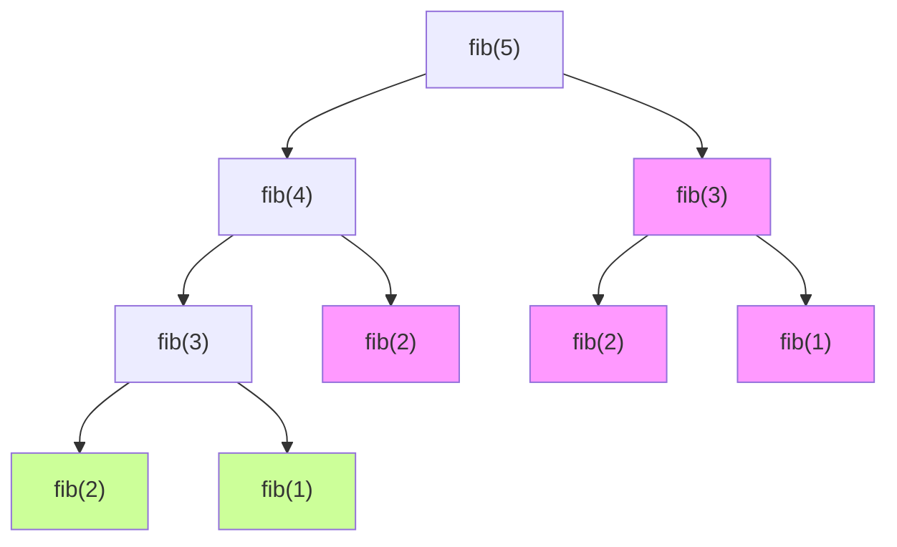

# Recursion and Dictionaries
Recursion is like [mathematical induction](https://en.wikipedia.org/wiki/Mathematical_induction), a mathematical proof technique with two steps:

* proving for the **base case**: showing that the statement is true for *n = 0*
* **the induction step**: showing that if it is true for some *n = k*, it is also true for *n = k + 1*.

Together, these steps show that the statement is true for every *n*.

How is this like recursion? In recursion, we define how the program behaves for a base case, then define the recursive step.
***
A recursive solution may not be as **efficient**, i.e., complete in as few steps, as an iterative solution. But when computers are so fast nowadays, who cares? Recursive solutions may be more intuitive than iterative ones.
***
That said, the inefficiency of a recursive solution can be reduced by avoiding recalculating values: just store already-calculated values in a dictionary.
```
def fib_inefficient(n):
	if n == 1:
		return 1
	elif n == 2:
		return 2
	else:
		return fib(n-1) + fib(n-2)
```
The above code is inefficient as it requires lots of recalculations (shown in red below). Base cases are green:

***
A more efficient Fibonacci function, which stores calculated values in a dictionary, is:
```
def fibb_efficient(n, d):
	if n in d:
		return d[n]
	else:
		ans =  fibb_efficient(n-1, d) + fibb_efficient(n-2, d)
		d[n] = ans
		return ans

d = {1:1, 2:2} # base cases 
```
***
A comparison of scale:
* calling `fib_inefficient(34)` results in 11,405,773 recursive calls
* calling `fib_efficient(34)` results in 65 recursive calls
***
For dictionaries:
* values:
	* may be **immutable or mutable**
	* may be **duplicates**
* keys:
	* must be **immutable** (`int`, `float` (not recommended as you need to remember the float exactly to look it up), `string`, `tuple`, `bool`)
	* must be **unique**

Keys aren't ordered!

